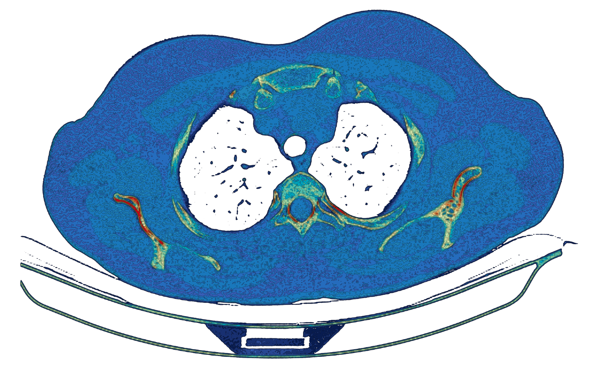

## Geospatial Data Visualization Exercise

### Visualization of CT scan images using Contour Map

1. Use the data in data folder (Data_CT.csv)
2. Use the code from Example 03 to load the data
3. Modify the code such that you can generate the visualization below:

